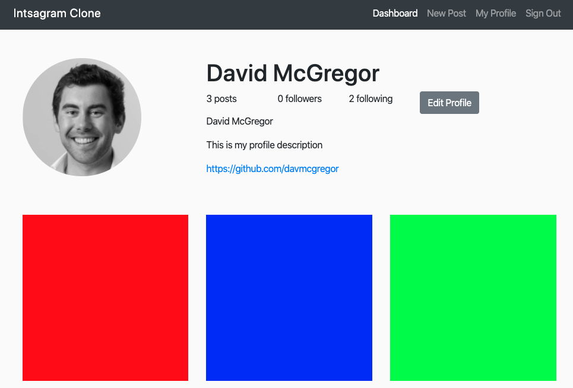

### [Makers Academy](http://www.makersacademy.com) - Additional programming challenge 

# Instagram Challenge ❤️

Link to App - https://offtherails-acebook.herokuapp.com/

#### Technologies: Ruby, Rails, HTML, SCSS

[Task](#Task) | [Installation Instructions](#Installation) | [User Stories](#User_Stories) | [Further improvements](#Further_Improvements)



## <a name="Task">The Task</a>

Build Instagram: Simple huh!

Your challenge is to build Instagram using Rails. You'll need **users** who can post **pictures**, write **comments** on pictures and **like** a picture. Style it like Instagram's website (or more awesome).

Bonus if you can add filters!

This challenge is an additional programming challenge at [Makers Academy](https://github.com/makersacademy).

## <a name="Installation">Installation Instructions</a>

First, clone this repository. Then:

```bash
> bundle install
> rake db:create
> rake db:migrate
> rails server 
```
Visit the app at localhost:3000

## <a name="Further_Improvements">Further Improvements</a>

* Styling
* More features: multiple users, comments, likes, filters etc.
* Follow [this tutotial](https://www.youtube.com/watch?v=yhg7hd3ogJ8&t)